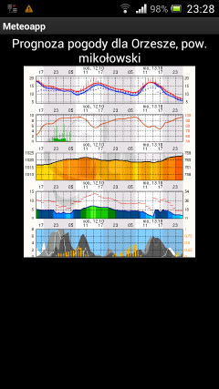
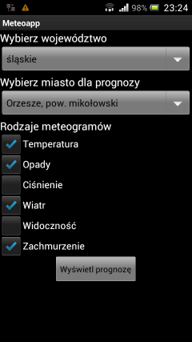
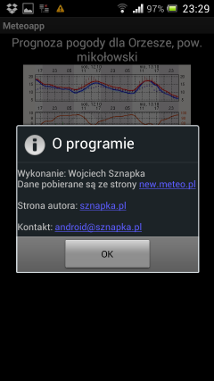

# Meteoapp

Android Java application which fetches an meteograms from new.meteo.pl, 
cuts them into 6 parts and displays choosen parts for a given city.

Meteoapp uses [meteo](https://github.com/wowo/meteo) library to interact with new.meteo.pl

## Download

For some reasons this isn't available on Google Play marketplace,
but you could install it directly from my website: [sznapka.pl/meteoapp.apk](http://sznapka.pl/meteoapp.apk)

## Screenshots

 ,
 ,

## Credits

*Author:* Wojciech Sznapka, 2013

*License:* MIT Licence
